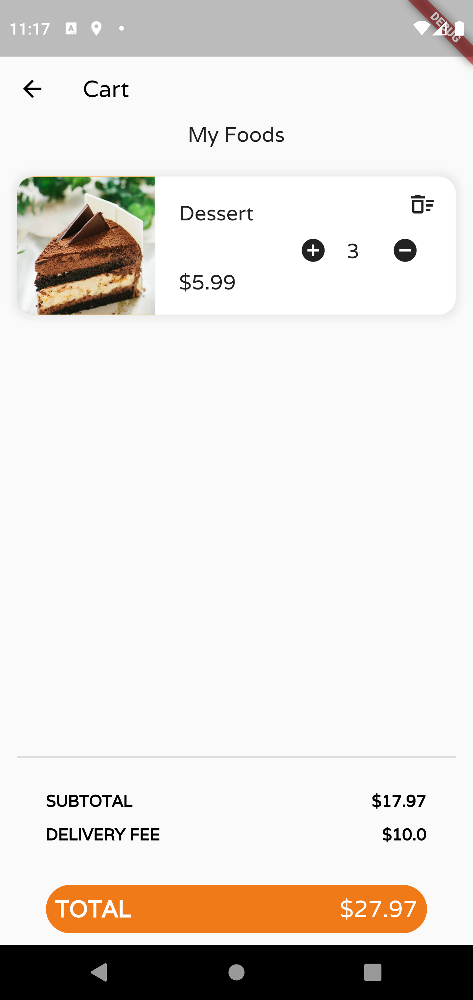

# Online Shop App with Clean Architecture, Bloc and Freezed

The aplication is a small online shop app with a product overview page, a product detail page and a shopping basket. 
It makes use of freezed and the flutter_bloc package for state management, following the clean architecture pattern.

  
  
  
  
  
  
